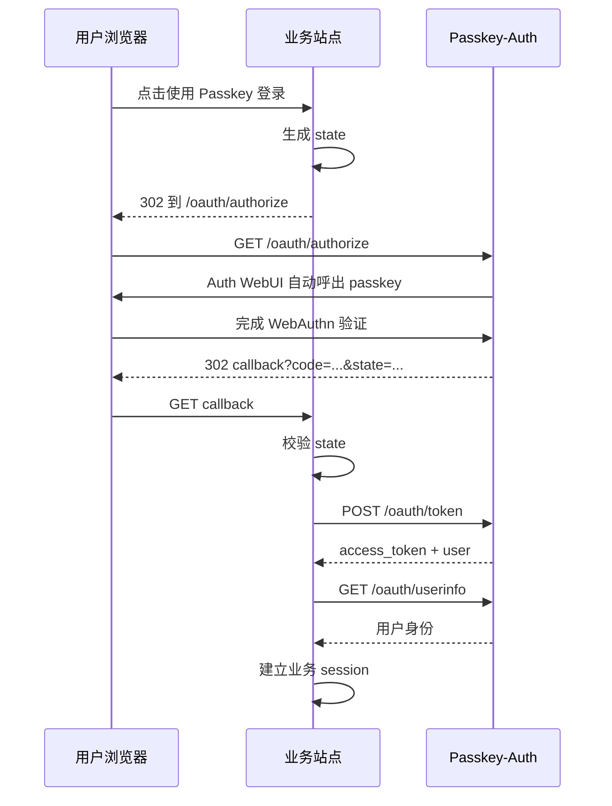
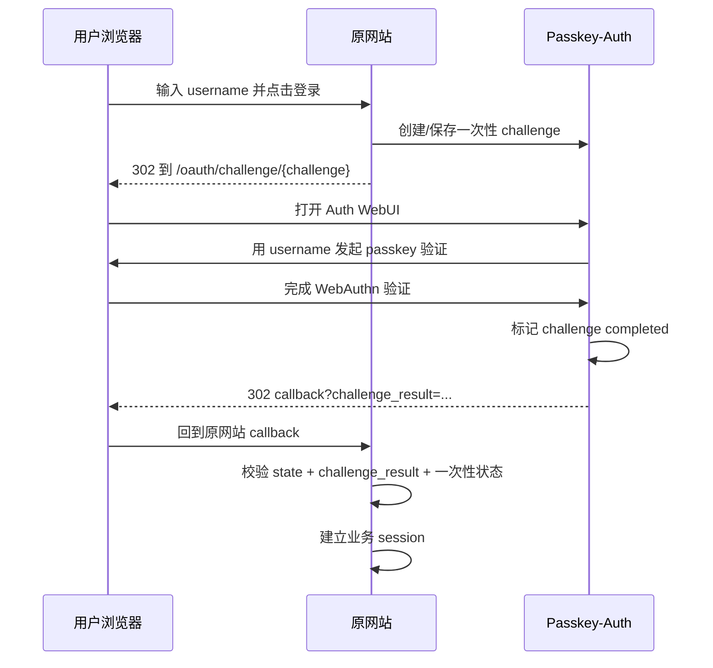

# OAuth 接入开发文档

本文面向需要把业务站点接入 Passkey-Auth 的开发者，说明如何正确使用内置 OAuth、link challenge 和服务端验证能力。

## 架构定位

Passkey-Auth 是一个基于 WebAuthn/passkey 的认证服务。它负责：

- 在 Auth WebUI 中完成 passkey 验证
- 为业务系统签发 OAuth authorization code 或 challenge 成功参数
- 提供用户稳定身份标识 `sub`
- 提供服务端 session 验证 API

业务系统负责：

- 发起登录跳转
- 校验 `state`
- 服务端换取 token 或校验 challenge result
- 建立自己的业务登录态
- 维护业务权限、角色和本地用户资料

推荐域名形态：

```text
https://auth.xxxxx                 Passkey-Auth 服务
https://login.xxxxx                业务登录入口或统一登录门户
https://app.xxxxx                  业务系统
```

## 选择接入方式

| 场景 | 推荐方式 | 说明 |
| --- | --- | --- |
| 独立第三方网站接入 | OAuth authorization code flow | 标准 OAuth 形态，业务后端用 code 换 token |
| 同一组织内轻量登录跳转 | link challenge flow | 类似 Cloudflare challenge，回跳带签名成功参数 |
| 已经共享 Auth session 的后端 | 服务端 session verify API | 业务后端拿 session cookie 到 Auth 服务验证 |
| 本地 demo 和调试 | `/demo/oauth`、`/demo/third-party`、`/demo/link-login` | 用来理解流程，不是生产 UI |

生产环境优先使用标准 OAuth authorization code flow。link challenge flow 更适合你同时控制 Auth 服务和原站 callback 的场景。

## 基础配置

默认配置集中在 `passkey_demo/config.py`。运行时可用环境变量覆盖：

```bash
FLASK_SECRET_KEY=change-to-a-long-random-secret
PASSKEY_RP_ID=xxxxx
PASSKEY_ORIGIN=https://auth.xxxxx
PASSKEY_RP_NAME="Passkey Auth"
PASSKEY_DATABASE=/var/lib/passkey-auth/passkeys.sqlite3
PASSKEY_REGISTRATION_ENABLED=false
PASSKEY_SERVER_API_TOKEN=change-to-server-token
PASSKEY_OAUTH_CLIENT_ID=your-client-id
PASSKEY_OAUTH_CLIENT_SECRET=your-client-secret
PASSKEY_OAUTH_CLIENT_NAME="Your Login Client"
PASSKEY_OAUTH_REDIRECT_URIS=https://login.xxxxx/callback
PASSKEY_OAUTH_CODE_TTL_SECONDS=300
PASSKEY_OAUTH_ACCESS_TOKEN_TTL_SECONDS=3600
PASSKEY_OAUTH_CHALLENGE_TTL_SECONDS=300
PASSKEY_TRUST_PROXY_HEADERS=true
PASSKEY_HTTP3_ALT_SVC='h3=":443"; ma=86400'
```

关键配置说明：

- `FLASK_SECRET_KEY`：必须固定且保密。access token、challenge result 和 Flask session 都依赖它签名。
- `PASSKEY_RP_ID`：WebAuthn RP ID。线上通常设置为根域名，例如 `xxxxx`。
- `PASSKEY_ORIGIN`：Auth WebUI 的真实 HTTPS origin，例如 `https://auth.xxxxx`。
- `PASSKEY_OAUTH_CLIENT_ID`：业务系统使用的 OAuth client id。
- `PASSKEY_OAUTH_CLIENT_SECRET`：业务系统后端保存的 OAuth client secret。
- `PASSKEY_OAUTH_REDIRECT_URIS`：允许的业务 callback 地址；支持逗号或换行分隔多个精确 URL。
- `PASSKEY_REGISTRATION_ENABLED`：生产默认保持 `false`，需要开通用户时再短期开启。
- `PASSKEY_SERVER_API_TOKEN`：服务端验证 API 的 Bearer token，必须只在后端保存。
- `PASSKEY_TRUST_PROXY_HEADERS`：只在可信反向代理会覆盖 `X-Forwarded-*` 头时开启。
- `PASSKEY_HTTP3_ALT_SVC`：当 TLS 反向代理已支持 HTTP/3/QUIC 时，用于发送 `Alt-Svc`。

如果部署在子域名 `auth.xxxxx`，常见设置是：

```bash
PASSKEY_RP_ID=xxxxx
PASSKEY_ORIGIN=https://auth.xxxxx
```

`PASSKEY_RP_ID=xxxxx` 允许 `auth.xxxxx` 作为 passkey 的 RP 子域使用。浏览器实际访问 Auth WebUI 的地址必须和 `PASSKEY_ORIGIN` 完全一致。

## 标准 OAuth Authorization Code Flow

### 流程图



### 1. 业务站点发起授权

业务后端生成随机 `state`，保存到业务 session，然后跳转到：

```text
GET https://auth.xxxxx/oauth/authorize?response_type=code&client_id=your-client-id&redirect_uri=https%3A%2F%2Flogin.xxxxx%2Fcallback&state=random-state
```

参数：

| 参数 | 必填 | 说明 |
| --- | --- | --- |
| `response_type` | 是 | 固定为 `code` |
| `client_id` | 是 | `PASSKEY_OAUTH_CLIENT_ID` |
| `redirect_uri` | 是 | 必须在 Auth 服务允许列表中 |
| `state` | 是 | 业务站点生成的随机值，用于防 CSRF |

示例：

```python
from urllib.parse import urlencode
import secrets

state = secrets.token_urlsafe(24)
session["oauth_state"] = state

params = urlencode({
    "response_type": "code",
    "client_id": "your-client-id",
    "redirect_uri": "https://login.xxxxx/callback",
    "state": state,
})

return redirect(f"https://auth.xxxxx/oauth/authorize?{params}")
```

### 2. Auth WebUI 完成 passkey 验证

`/oauth/authorize` 会渲染极简 Auth WebUI，并自动调用：

```text
POST /api/login/options
POST /api/login/verify
POST /oauth/authorize/complete
```

业务站点不需要直接调用这些浏览器端 API。它们由 Auth WebUI 内部完成。

### 3. 业务 callback 校验 state

Auth 成功后跳回：

```text
https://login.xxxxx/callback?code=...&state=...
```

业务后端必须先校验 `state`：

```python
if request.args["state"] != session.pop("oauth_state", None):
    abort(400, "invalid_state")
```

不要在 `state` 校验失败时继续换 token。

### 4. 用 code 换 token

业务后端调用：

```http
POST https://auth.xxxxx/oauth/token
Content-Type: application/x-www-form-urlencoded

grant_type=authorization_code&
code=AUTH_CODE&
redirect_uri=https%3A%2F%2Flogin.xxxxx%2Fcallback&
client_id=your-client-id&
client_secret=your-client-secret
```

当前实现会读取 `client_id`、`client_secret`、`code`、`redirect_uri`。`grant_type` 可传入以保持标准形态。

也支持 Basic Auth：

```http
Authorization: Basic base64(client_id:client_secret)
```

成功响应：

```json
{
  "ok": true,
  "access_token": "signed-token",
  "token_type": "Bearer",
  "expires_in": 3600,
  "authenticated": true,
  "user": {
    "sub": "stable-user-handle",
    "id": 1,
    "username": "alice",
    "createdAt": 1780000000
  }
}
```

失败响应示例：

```json
{
  "ok": false,
  "error": "invalid_grant",
  "error_description": "authorization code 无效、已使用或已过期"
}
```

注意：

- authorization code 只能使用一次。
- authorization code 只以 PBKDF2 派生值保存，数据库不保存原始 code。
- `redirect_uri` 必须和发起授权时完全一致。
- `client_secret` 只能保存在后端。
- `access_token` 当前是服务端签名 token，不是 JWT。

### 5. 获取 userinfo

业务后端可用 access token 获取用户信息：

```http
GET https://auth.xxxxx/oauth/userinfo
Authorization: Bearer ACCESS_TOKEN
```

响应：

```json
{
  "sub": "stable-user-handle",
  "id": 1,
  "username": "alice",
  "createdAt": 1780000000
}
```

字段说明：

- `sub`：稳定用户标识，来自 WebAuthn user handle。业务系统应优先用它绑定本地用户。
- `id`：Auth 服务内部用户 ID。适合调试，不建议作为跨系统主键。
- `username`：用户注册时的名称。
- `createdAt`：Auth 用户创建时间，Unix timestamp。

## Link Challenge Flow

link challenge flow 适合这种体验：

```text
用户在 https://login.xxxxx 输入用户名
跳转到 https://auth.xxxxx/oauth/challenge/{challenge}
passkey 成功后回跳 https://login.xxxxx/callback?challenge=...&challenge_result=...&state=...&status=success
```

它更像“认证挑战成功参数”，但安全性来自服务端校验，不是来自 `status=success`。

### 流程图



### 1. 原网站创建 challenge

当前 demo 入口：

```text
POST /demo/link-login/start
```

真实接入时，原网站后端应保存：

- `challenge_id`
- `client_id`
- `return_uri`
- `username`
- `state`
- `expires_at`
- `completed_at`
- `consumed_at`
- `user_id`

demo 中这些字段存储在 SQLite 表 `oauth_challenge_requests`。

### 2. 跳转到 Auth WebUI

```text
302 https://auth.xxxxx/oauth/challenge/{challenge_id}
```

Auth 服务会校验：

- challenge 是否存在
- challenge 是否过期
- challenge 是否未完成、未消费
- `client_id` 是否有效
- `return_uri` 是否在允许列表

然后 Auth WebUI 会使用 challenge 里保存的 `username` 发起 passkey 验证。

### 3. Auth 签发 challenge result

验证成功后 Auth 服务调用：

```text
POST /oauth/challenge/{challenge_id}/complete
```

成功响应：

```json
{
  "ok": true,
  "redirectUrl": "https://login.xxxxx/callback?challenge=...&challenge_result=...&state=...&status=success"
}
```

`challenge_result` 内部绑定：

- `challenge_id`
- `client_id`
- `state`
- `user_id`
- `sub`

### 4. 原网站 callback 校验

原网站收到：

```text
GET /callback?challenge=...&challenge_result=...&state=...&status=success
```

必须按顺序校验：

1. 校验业务 session 里的 `state`
2. 校验 `challenge_result` 签名
3. 校验 token 中的 `challenge_id` 与 URL 参数一致
4. 校验 token 中的 `client_id/state/user_id/sub`
5. 校验 challenge 已完成、未消费、未过期
6. 把 challenge 标记为 consumed
7. 建立业务 session

不要把 `status=success` 当成登录依据。它只是给前端展示用。

当前 demo 的校验逻辑在 `_consume_challenge_result_token(...)`。如果原网站和 Auth 服务分离部署，推荐两种方式：

- 原网站后端调用 Auth 服务提供的服务端验证端点
- 将签名校验和一次性 challenge 消费逻辑放在同一个认证后端中

不要只在浏览器端解析 `challenge_result`。

## 服务端 Session Verify API

如果业务后端能拿到 Auth 服务的 session cookie，可以调用：

```http
POST https://auth.xxxxx/api/server/session/verify
Authorization: Bearer SERVER_API_TOKEN
Content-Type: application/json
```

请求体可以为空，此时验证当前请求携带的 Flask session cookie。

也可以显式传入 cookie：

```json
{
  "sessionCookie": "session=..."
}
```

成功登录时：

```json
{
  "ok": true,
  "authenticated": true,
  "user": {
    "sub": "stable-user-handle",
    "id": 1,
    "username": "alice",
    "createdAt": 1780000000
  }
}
```

未登录时：

```json
{
  "ok": true,
  "authenticated": false
}
```

适用场景：

- 同域或可信后端之间共享/转发 Auth session
- API gateway 在入口统一校验登录态
- 内部系统需要快速确认用户身份

安全要求：

- `PASSKEY_SERVER_API_TOKEN` 必须只存在后端
- 不要把该接口暴露给不可信客户端直接调用
- 建议在反向代理层限制来源 IP 或服务网段

## 高级特性

### 无用户名 passkey 登录

根页面和标准 OAuth flow 支持无用户名登录。浏览器会显示可用 passkey，用户选择后后端通过 WebAuthn user handle 找到用户。

适合：

- SSO 登录页
- 用户不想先输入用户名的登录体验
- 多设备 passkey 同步场景

### 用户名绑定 challenge

link challenge flow 会把原网站输入的 `username` 存进 challenge。Auth WebUI 验证 passkey 时会使用该用户名限制 credential。

好处：

- 用户在原网站输入哪个账号，就只能用该账号的 passkey
- 避免浏览器弹出不相关账号
- callback 可以拒绝“passkey 用户和原网站用户名不匹配”

### 一次性 code 和 challenge

内置存储会消费：

- `oauth_authorization_codes`
- `oauth_challenge_requests`

已使用、过期或被消费的 code/challenge 不能再次登录，可降低重放攻击风险。

### Token TTL

可通过配置控制：

```bash
PASSKEY_OAUTH_CODE_TTL_SECONDS=300
PASSKEY_OAUTH_ACCESS_TOKEN_TTL_SECONDS=3600
PASSKEY_OAUTH_CHALLENGE_TTL_SECONDS=300
```

建议：

- code/challenge 保持较短，通常 1-5 分钟
- access token 根据业务需要设置，内部系统可短一些
- 如果需要长期登录，由业务系统自己的 session 负责

### 注册入口保护

注册默认关闭：

```bash
PASSKEY_REGISTRATION_ENABLED=false
```

需要创建新用户时再临时开启：

```bash
PASSKEY_REGISTRATION_ENABLED=true
```

注册 UI 还有额外的短期解锁状态，由 `REGISTER_UNLOCK_TTL_SECONDS` 控制。

### 多 callback 支持

标准 OAuth client 默认允许内置示例 callback：

```text
/demo/oauth/callback
/demo/third-party/callback
/demo/link-login/callback
```

生产 callback 通过：

```bash
PASSKEY_OAUTH_REDIRECT_URIS=https://login.xxxxx/callback,https://app.xxxxx/oauth/callback
```

当前代码提供一个标准 OAuth client，内置示例页面和生产业务系统都走同一套 client 校验、redirect URI 白名单、authorization code 和 token 管道。旧的 `PASSKEY_OAUTH_DEMO_*` 变量仍作为兼容别名读取；新部署应使用 `PASSKEY_OAUTH_CLIENT_*`。

如果未来要支持多个独立业务系统，可以把 `_oauth_client(...)` 扩展为从数据库或配置文件读取 client 列表，包括：

- `client_id`
- `client_secret_hash`
- `client_name`
- `redirect_uris`
- `allowed_flows`
- `created_at`
- `disabled_at`

### 自定义 Auth WebUI

OAuth 授权页面复用：

```text
templates/oauth_authorize.html
static/oauth_authorize.js
```

可调整：

- 品牌 Logo
- 页面文案
- passkey 自动弹出策略
- 错误提示
- 暗色模式样式

不要把敏感信息、用户名以外的业务参数或 token 直接展示在 Auth WebUI。

## 生产接入清单

上线前确认：

- 使用 HTTPS
- `PASSKEY_ORIGIN` 与浏览器访问 Auth WebUI 的 origin 完全一致
- `PASSKEY_RP_ID` 设置为正确根域或当前域
- `FLASK_SECRET_KEY` 固定且强随机
- `PASSKEY_OAUTH_CLIENT_SECRET` 已替换
- `PASSKEY_SERVER_API_TOKEN` 已替换
- `PASSKEY_REGISTRATION_ENABLED=false`
- callback URL 使用精确白名单
- code/challenge/access token TTL 合理
- 数据库文件路径持久化且备份
- 反向代理保留正确 Host 和 HTTPS 信息
- 可信代理场景已开启 `PASSKEY_TRUST_PROXY_HEADERS=true`
- 只有确认代理支持 HTTP/3 后才设置 `PASSKEY_HTTP3_ALT_SVC`
- 业务 callback 必须校验 `state`
- 业务后端不把 `client_secret`、server token 暴露给浏览器

反向代理建议传递：

```nginx
proxy_set_header Host $host;
proxy_set_header X-Forwarded-Proto https;
proxy_set_header X-Forwarded-For $proxy_add_x_forwarded_for;
```

如果你的 Flask 部署在代理后面，并且这些头只来自可信代理，可以设置：

```bash
PASSKEY_TRUST_PROXY_HEADERS=true
```

这会让 Flask 使用代理后的 scheme/host 生成 OAuth redirect URL。仍建议显式设置 `PASSKEY_ORIGIN`，避免 WebAuthn origin 不匹配。

HTTP/3 不是 Flask 应用直接提供的能力；它需要由前置 TLS 代理终止 QUIC。例如 Caddy、NGINX QUIC 构建或 Cloudflare 可以在边缘启用 HTTP/3。确认代理已经支持 HTTP/3 后，再设置：

```bash
PASSKEY_HTTP3_ALT_SVC='h3=":443"; ma=86400'
```

应用只会在 HTTPS 响应中发送该 `Alt-Svc`，本地 HTTP demo 不会宣告 HTTP/3。

## 错误处理

常见错误：

| 错误 | 常见原因 | 处理 |
| --- | --- | --- |
| `invalid_client` | client_id 错误或 redirect_uri 不在白名单 | 检查 client 配置和 callback URL |
| `unsupported_response_type` | response_type 不是 `code` | 改为 `response_type=code` |
| `invalid_state` | callback state 不一致 | 检查业务 session、cookie、跳转链路 |
| `invalid_grant` | code 已使用、过期或 redirect_uri 不一致 | 重新发起授权 |
| `access token 无效或已过期` | token 过期或签名密钥变化 | 重新登录，检查 `FLASK_SECRET_KEY` 是否固定 |
| `challenge 不存在或已过期` | challenge 超时或被清理 | 重新发起 link challenge |
| `challenge_result 签名无效` | token 被篡改或密钥不一致 | 拒绝登录，检查部署密钥 |
| `passkey 用户和原网站用户名不匹配` | 用户输入账号与 passkey 归属不同 | 提示用户确认账号 |
| `Passkey 校验失败` | RP ID、origin、浏览器 credential 不匹配 | 检查 `PASSKEY_RP_ID`、`PASSKEY_ORIGIN` 和 HTTPS |

调试建议：

- 本地使用 `localhost`，不要用裸 IP 混用 origin
- 每次换端口时同步设置 `PASSKEY_ORIGIN`
- 浏览器里删除旧 passkey 后重新注册可排除 credential 污染
- 检查 callback URL 是否 URL 编码
- 检查 code 是否被重复换取

## 示例：业务后端最小接入

以下示例展示标准 OAuth flow 的核心逻辑：

```python
import requests
import secrets
from flask import Flask, abort, redirect, request, session
from urllib.parse import urlencode

app = Flask(__name__)
app.secret_key = "business-app-secret"

AUTH_BASE = "https://auth.xxxxx"
CLIENT_ID = "your-client-id"
CLIENT_SECRET = "your-client-secret"
REDIRECT_URI = "https://login.xxxxx/callback"


@app.get("/login")
def login():
    state = secrets.token_urlsafe(24)
    session["oauth_state"] = state
    params = urlencode({
        "response_type": "code",
        "client_id": CLIENT_ID,
        "redirect_uri": REDIRECT_URI,
        "state": state,
    })
    return redirect(f"{AUTH_BASE}/oauth/authorize?{params}")


@app.get("/callback")
def callback():
    state = request.args.get("state", "")
    if not state or state != session.pop("oauth_state", ""):
        abort(400, "invalid_state")

    token_response = requests.post(
        f"{AUTH_BASE}/oauth/token",
        data={
            "code": request.args.get("code", ""),
            "redirect_uri": REDIRECT_URI,
            "client_id": CLIENT_ID,
            "client_secret": CLIENT_SECRET,
        },
        timeout=10,
    )
    token_response.raise_for_status()
    token_data = token_response.json()

    user = token_data["user"]
    session["user_sub"] = user["sub"]
    session["username"] = user["username"]
    return "logged in"
```

## 代码位置索引

- OAuth 授权入口：`passkey_demo/app.py` 中 `/oauth/authorize`
- OAuth token：`passkey_demo/app.py` 中 `/oauth/token`
- OAuth userinfo：`passkey_demo/app.py` 中 `/oauth/userinfo`
- link challenge：`passkey_demo/app.py` 中 `/oauth/challenge/<challenge_id>`
- 服务端 session verify：`passkey_demo/app.py` 中 `/api/server/session/verify`
- challenge/code 存储：`passkey_demo/storage.py`
- WebAuthn 核心逻辑：`passkey_demo/webauthn_service.py`
- 统一配置：`passkey_demo/config.py`
